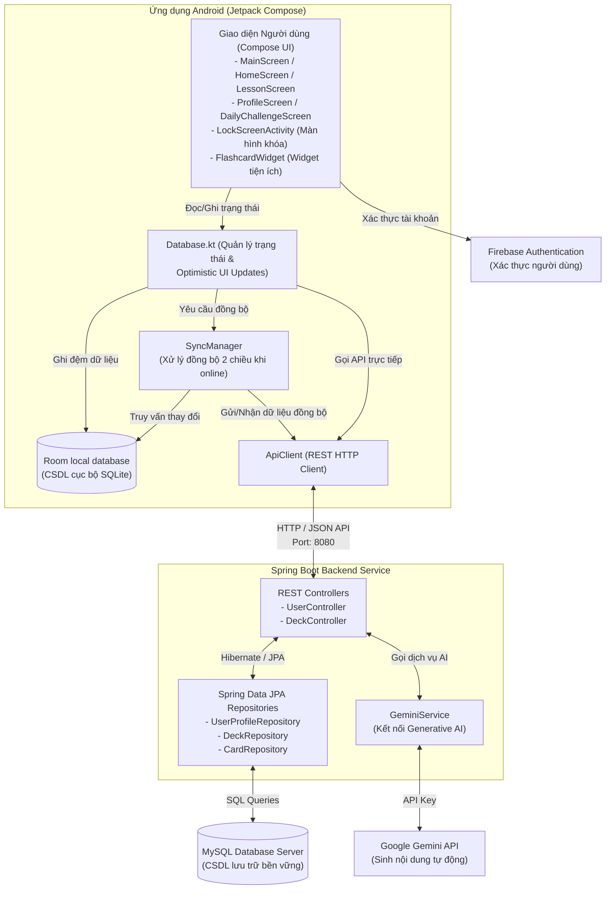

# Sơ đồ Kiến trúc Hệ thống Mind Card

Tài liệu này mô tả chi tiết kiến trúc tổng quan của hệ thống **Mind Card**, bao gồm sự tương tác giữa ứng dụng di động Android (Jetpack Compose, Room), máy chủ Spring Boot API, cơ sở dữ liệu MySQL, và các dịch vụ tích hợp bên thứ ba (Firebase Authentication, Google Gemini AI).

---

## 1. Sơ đồ luồng hoạt động (System Architecture Flowchart)

Dưới đây là sơ đồ Mermaid mô tả các thành phần và cách thức chúng giao tiếp với nhau:

---

## 2. Mô tả vai trò các thành phần (Component Descriptions)

### A. Android Client
1. **Compose UI**: Giao diện Jetpack Compose phản ứng nhạy bén (Reactive UI) bao gồm các màn hình học từ vựng xoay 3D, biểu đồ streak, huy hiệu hồ sơ, màn hình làm thử thách hàng ngày và lockscreen ôn tập.
2. **Database.kt**: Bộ quản lý trạng thái tập trung đóng vai trò như Single Source of Truth cho UI, thực hiện cơ chế **Optimistic UI Updates** (cập nhật giao diện lập tức trước khi server phản hồi để tối ưu trải nghiệm).
3. **Room Database**: CSDL cục bộ lưu trữ đệm toàn bộ danh sách bộ thẻ, thẻ học, và thông tin profile của người dùng. Cho phép ứng dụng hoạt động ngoại tuyến (Offline) bình thường.
4. **SyncManager**: Lắng nghe trạng thái mạng. Khi có mạng trở lại hoặc khi bấm nút "Sync Now", SyncManager sẽ thực hiện quét thay đổi và đồng bộ 2 chiều (Bidirectional Sync):
   * Đẩy các thay đổi cục bộ (Thêm, Sửa, Xóa mềm) lên Spring Boot Server.
   * Kéo dữ liệu mới nhất trên Server về cập nhật lại bộ đệm Room.

### B. Spring Boot Backend
1. **REST Controllers**: Cung cấp các API HTTP cho các hoạt động CRUD bộ thẻ, lưu trữ phiên học, và tích hợp AI.
2. **Gemini Service**: Đóng vai trò kết nối trực tiếp với mô hình ngôn ngữ lớn Google Gemini AI nhằm tự động sinh thẻ học tiếng Anh theo chủ đề do người dùng nhập.
3. **Spring Data JPA & Hibernate**: Quản lý ánh xạ các thực thể (Entity) đối tượng Java xuống cơ sở dữ liệu quan hệ MySQL và tự sinh schema bảng (`ddl-auto=update`).

### C. Cơ sở dữ liệu & Dịch vụ bên ngoài
1. **MySQL Database**: Cơ sở dữ liệu chính của hệ thống, lưu trữ thông tin lâu dài của tất cả người dùng, bộ thẻ, và phiên học.
2. **Firebase Authentication**: Đảm nhận xác thực và bảo mật tài khoản người dùng thông qua Email/Mật khẩu.
3. **Google Gemini API**: Trực tiếp xử lý Prompt từ người dùng để sinh ra cấu trúc dữ liệu JSON chứa từ vựng, phiên âm, từ loại, định nghĩa tiếng Việt, câu ví dụ, và từ đồng nghĩa.
